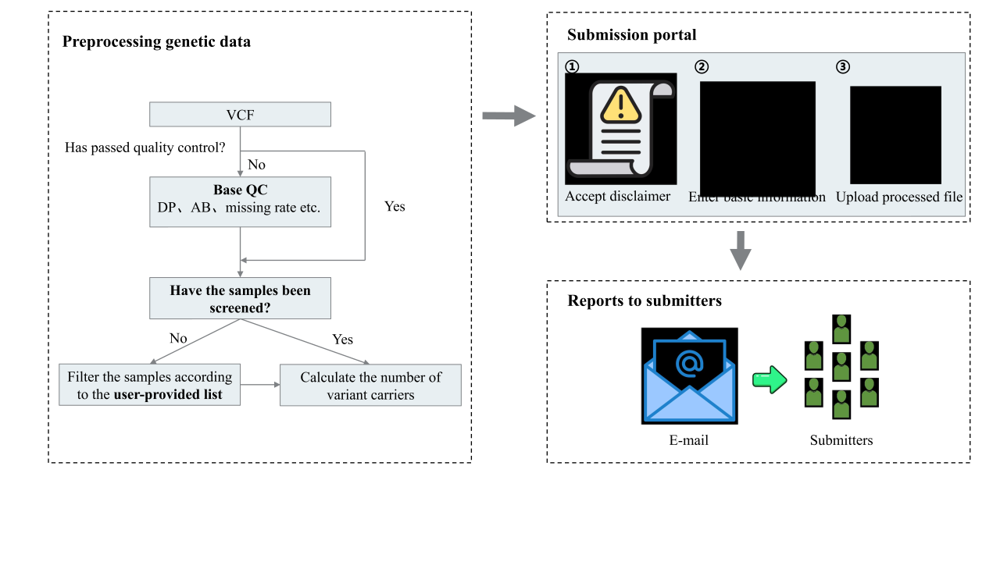

# PTpipe
[](https://snakemake.bitbucket.io)
[](https://anaconda.org/conda-forge/mamba)


PenetranceCards, a global, community-contributed public archive of variant penetrance. PTpipe is an offline script used to update penetrance in PenetranceCards. Previous studies have shown that the accuracy of penetrance is highly dependent on the sample size([McGurk, Kathryn A et al.](https://pubmed.ncbi.nlm.nih.gov/37652022/)). We encourage researchers worldwide to share their data, process it using PTpipe, and upload it to PenetranceCards, helping to enhance the accuracy of penetrance estimates within the platform.


<div align="center">
  
</div>

## General Settings
### Configure the 'home' path

```bash
cd /path/to/PTpipe/
vi ./config/config.yaml
home: /path/to/PTpipe
```

Other parameters can be automatically configured through the `PTpipe_run.py` script.

## Pipeline Setup
PTpipe can be executed using conda environments.

### Conda
This workflow can easily setup manually with the given environment file. Install Snakemake and dependencies using the command:

```bash
conda env create -f environment.yml
```

Enter the newly created environment with:

```bash
conda activate PTpipe
```

Download hg38 reference genome file.

```bash
wget https://hgdownload.soe.ucsc.edu/goldenPath/hg38/bigZips/hg38.fa.gz
```

Copy to the Reference path.

```bash
cp /path/to/hg38.fa.gz /path/to/PTseeker/data/reference/hg38.fa.gz
```

Configure the pipeline, and then execute the Snakemake pipeline through the `PTpipe_run.py` script.

```bash
python PTpipe_run.py
```

View the pipeline's help documentation.

```bash
python PTpipe_run.py --help
```

More installation details can be obtained in `install.sh`.

## Example
You can quickly get acquainted with the PTpipe pipeline by running our test data.

First, navigate to the directory where PTpipe is located.

```bash
cd /path/to/PTpipe/
```

If the file requires basic quality control and sample filtering, use the following command.

```bash
python PTpipe_run.py --input /path/to/PTpipe/data/Test/01_qc1.vcf.gz --base_qc --sample_filtering --samplelist /path/to/PTpipe/data/Example/Example_sample_list.txt --output /path/to/PTpipe/data/result/Test.txt
```

If the file requires basic quality control, use the following command.

```bash
python PTpipe_run.py --input /path/to/PTpipe/data/Test/01_qc1.vcf.gz --base_qc --output /path/to/PTpipe/data/result/Test.txt
```

If the file has already undergone quality control and sample filtering, then use this command.

```bash
python PTpipe_run.py --input /path/to/PTpipe/data/Test/02_qc2.vcf.gz --output /path/to/PTpipe/data/result/Test.txt
```

## License

This project is licensed under the MIT License. See the [LICENSE](LICENSE) file for details.